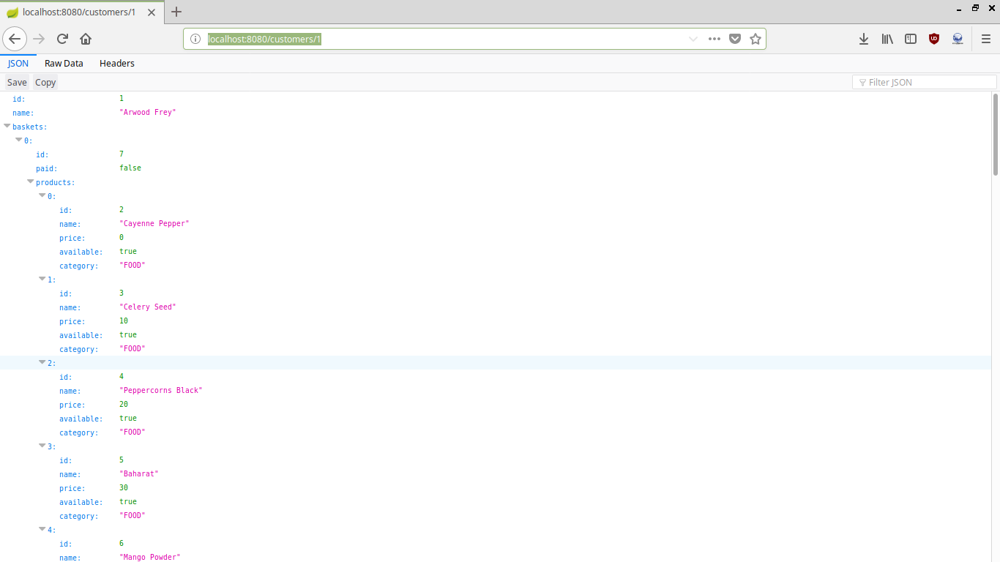

# Shopping  
Rest API for online shop.  
  
# Technology stack  
- Java  
- Maven  
- PostgreSQL  
- SpringBoot  
- Hibernate  
  
## Description  
  
Thanks to Hibernate framework Code-First approach was used to manage the entities and relationships between them. There are 3 types of the resources:  
- customers,  
- products,  
- baskets. 
 
For each resource there are implemented basic HTTP request method: get, post, put and delete. Those methods, except the delete one, use JSON files.  
  
## Screenshot  

Example customer data.
  
  
  
  
## More info  
  
Project made for [Codecool](https://codecool.com/) programming course.
